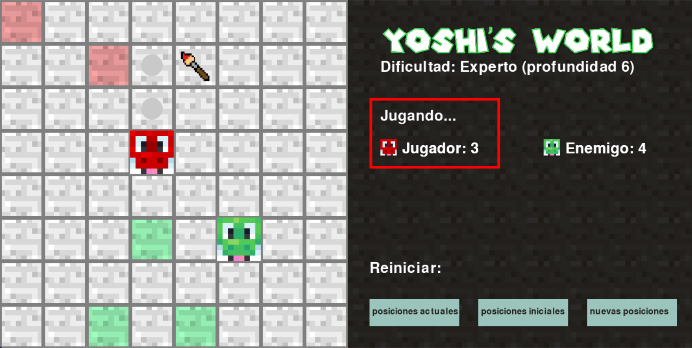

# Yoshi-s-World
Este proyecto desarrolla un juego llamado Yoshi’s World, en el cual dos jugadores (un jugador humano y la máquina) controlan a Yoshis (rojo y verde) que se mueven como caballos en un tablero de ajedrez. Las casillas alcanzadas por cada Yoshi se pintan de su color y no pueden ser usadas nuevamente. El juego termina cuando ninguno de los jugadores puede realizar más movimientos, y gana quien haya pintado más casillas. La máquina toma decisiones utilizando un algoritmo minimax con decisiones imperfectas.



## Modos de Dificultad:
El juego presenta tres niveles de dificultad (principiante, amateur y experto), que determinan la profundidad del árbol minimax usado por la máquina:

- Principiante: Profundidad 2
- Amateur: Profundidad 4
- Experto: Profundidad 6

## Turnos de Juego:
La máquina siempre inicia el juego controlando al Yoshi verde. Las posiciones iniciales de los Yoshis son aleatorias y nunca coinciden.

### La aplicación permite:
- Seleccionar el nivel de dificultad al iniciar el juego
- Reiniciar el juego durante una partida, ya sea usando las mismas posiciones iniciales, las posiciones actuales o generando nuevas posiciones aleatoriamente
- Visualizar los movimientos posibles del jugador al colocar el cursor sobre ellos
- Visualizar la puntuación de cada jugador y casillas pintadas en todo momento

### Heuristica

La heurística usada por la máquina en el algoritmo minimax se explica en [Heuristic_Report.pdf](Heuristic_Report.pdf)

### Instalar dependencias:
```shell
pip install -r requirements.txt

```